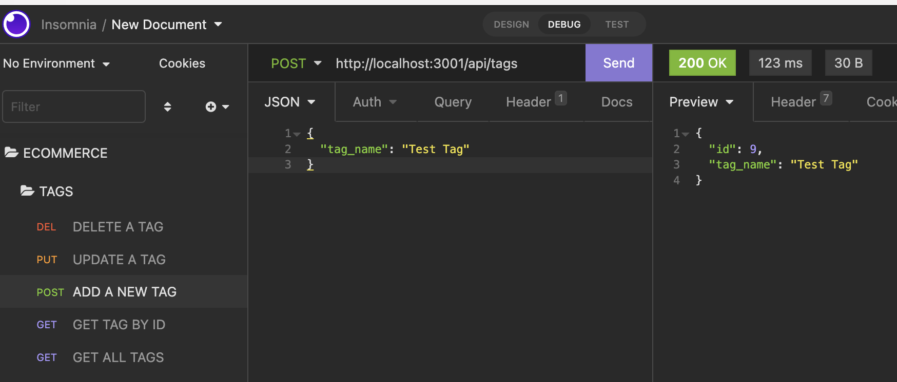
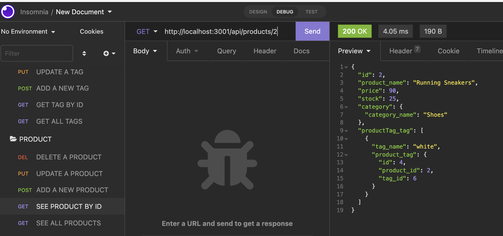
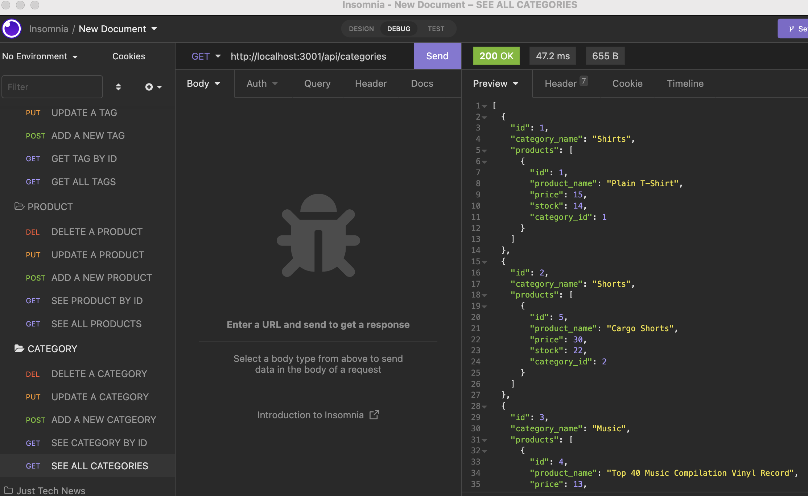

# E-commerce Back End Set-Up

## Table of Contents
* [Description](#description)
* [Video](#video-walk-through)
* [License](#license)
* [ScreenShots](#screenshots)

## Video Walk Through
https://user-images.githubusercontent.com/99932948/172064001-ea6ac680-b57b-467a-b3c0-767b66c46fc6.mp4

## Description
A back end for a e-commerce website that uses dotenv, express, mysql2, and sequelize to allow end users to find all, find one, create, update, and delete categories, products, and tags. The user must first add their own database name, MySQL username and MySQL password to a .env file. Then they will run the command "npm start seed" from the terminal to seed the table with data. Finally the user will enter in the command "npm start" to start the server. 

## License 

## Screenshots 

